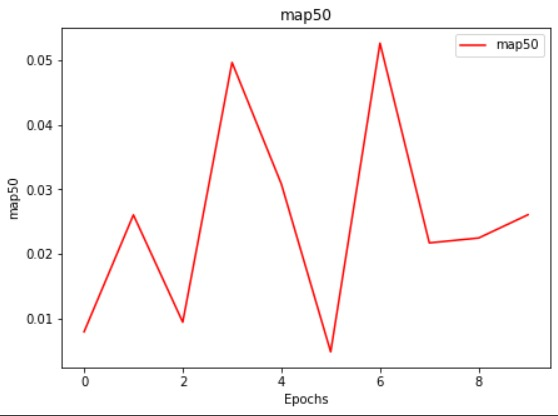
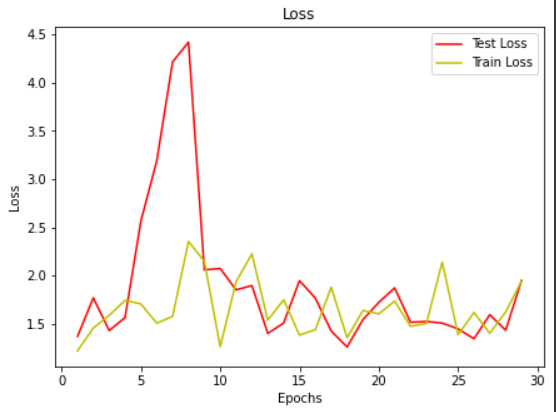
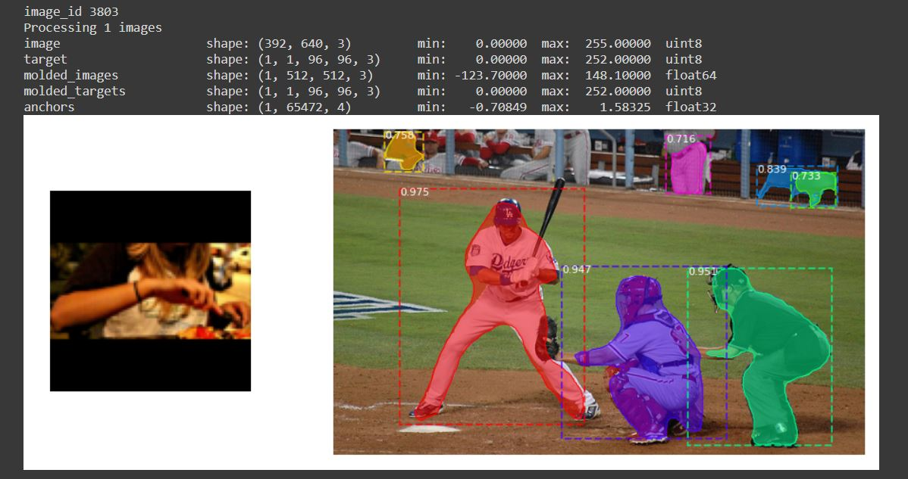
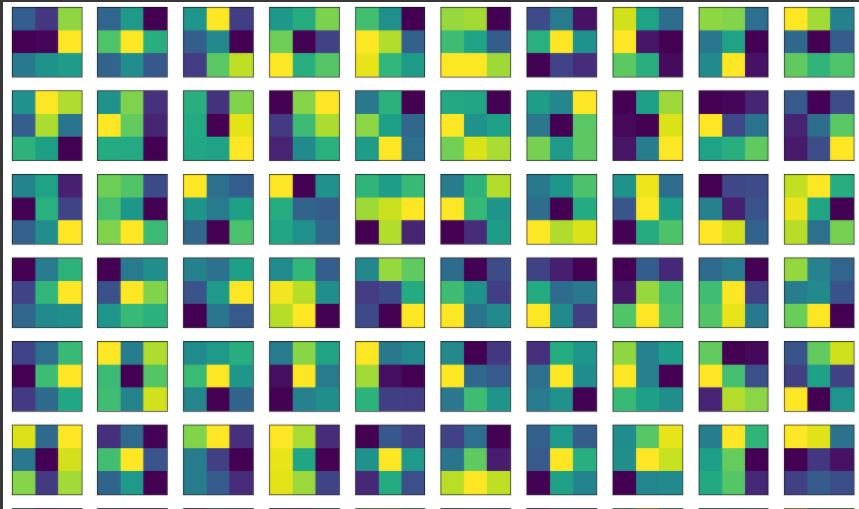
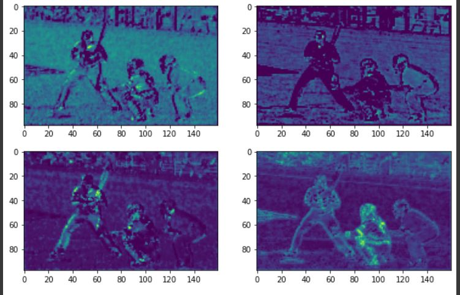

# Siamese Mask R-CNN

This is the official implementation of Siamese Mask R-CNN from [One-Shot Instance Segmentation](https://arxiv.org/abs/1811.11507). It is based on the [Mask R-CNN](https://arxiv.org/abs/1703.06870) implementation by [Matterport](https://github.com/matterport/Mask_RCNN).

 

The repository includes:
- [x] Source code of Siamese Mask R-CNN
- [x] Training code for MS COCO
- [x] Evaluation on MS COCO metrics (AP)
- [x] Training and evaluation of one-shot splits of MS COCO
- [x] Training code to reproduce the results from the paper
- [x] Pre-trained weights for ImageNet
- [x] Pre-trained weights for all models from the paper
- [x] Code to evaluate all models from the paper
- [x] Code to generate result figures

## One-Shot Instance Segmentation

One-shot instance segmentation can be summed up as: Given a query image and a reference image showing an object of a novel category, we seek to detect and segment all instances of the corresponding category (in the image above ‘person’ on the left, ‘car’ on the right). Note that no ground truth annotations of reference categories are used during training.
This type of visual search task creates new challenges for computer vision algorithms, as methods from metric and few-shot learning have to be incorporated into the notoriously hard tasks ofobject identification and segmentation. 
Siamese Mask R-CNN extends Mask R-CNN - a state-of-the-art object detection and segmentation system - with a Siamese backbone and a matching procedure to perform this type of visual search.

## Installation
Make sure Tensorflow version is *1.14.0* and Keras is *2.2.4* and make sure the current working directory is `siamese_mask_rcnn_master`.

## Download Pretrained Weights

Get the pretrained weights from the [releases menu](https://github.com/bethgelab/siamese-mask-rcnn/releases) and save them to `/checkpoints` in the main directory.
Your `/checkpoints` should have the following files:
- imagenet_687.h5
- large_siamese_mrcnn_coco_full_0320.h5
- small_siamese_mrcnn_0160.h5

## Training

To train siamese mask r-cnn on MS COCO simply follow the instructions in the [training.ipynb](train.ipynb) notebook. 
To train without issues, make sure the argument *auto_download* is set to *True* in the *coco_load* function. This will download the train2017 and val2017 folders for you.

Our models are trained on the coco 2017 training set, of which we remove the last 3000 images for validation.

If run correctly, you should see the following map50 plot,

 

Along with the following loss plot.

 

## Evaluation

To evaluate and visualize a models results run the [evaluation.ipynb](evaluate.ipynb) notebook.

We use the coco 2017 val set for testing and the last 3000 images from the training set for validation.

If run correctly, you should see the following results.

 

## Visualization

To visualize layers, kernels and feature maps of the ResNet50 backbone, run the [visualize.ipynb](visualize.ipynb) notebook.

If run correctly, you should see the following results.

 

The following is the output for the feature maps.

 

## Model description

Siamese Mask R-CNN is designed as a minimal variation of Mask R-CNN which can perform the visual search task described above. For more details please read the [paper](https://arxiv.org/abs/1811.11507).

 

## Citation

If you use this repository or want to reference our work please cite our paper:

@article{michaelis_one-shot_2018,
    title = {One-Shot Instance Segmentation},
    author = {Michaelis, Claudio and Ustyuzhaninov, Ivan and Bethge, Matthias and Ecker, Alexander S.},
    year = {2018},
    journal = {arXiv},
    url = {http://arxiv.org/abs/1811.11507}
}
